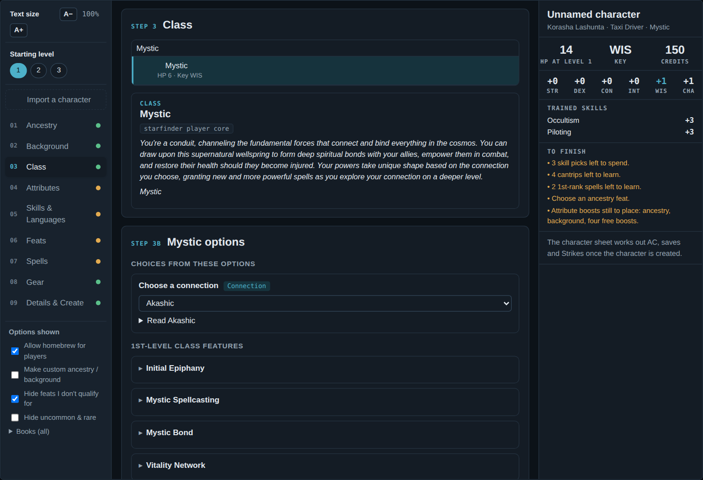
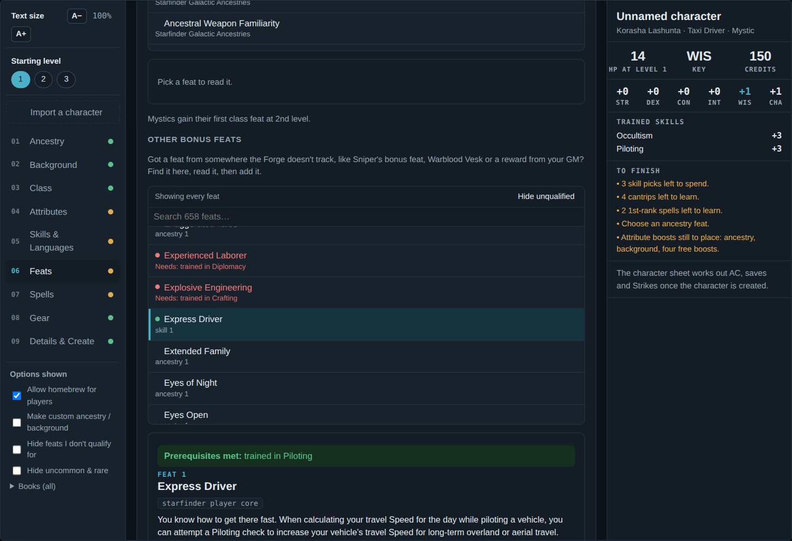
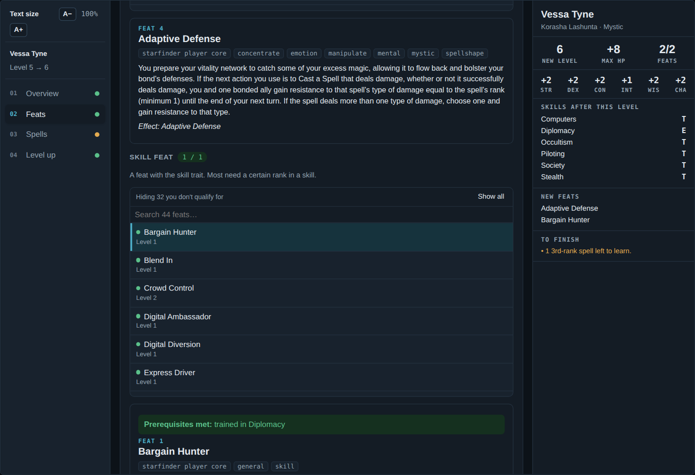
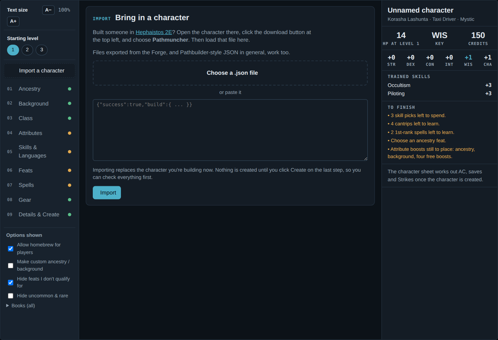
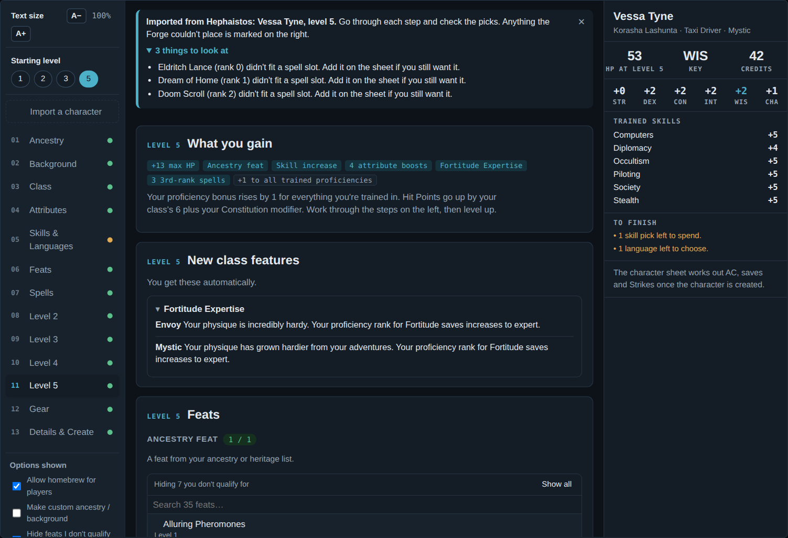
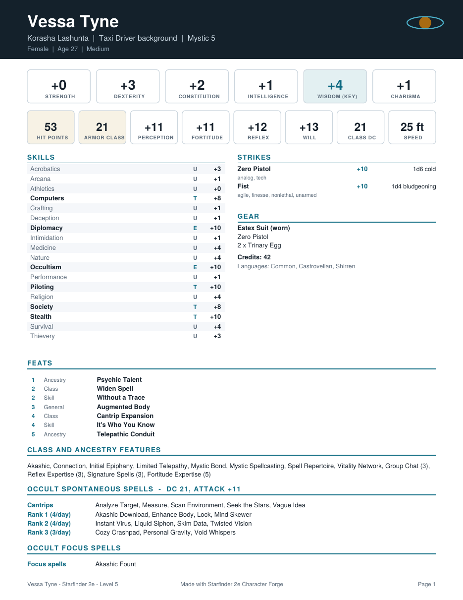

# Starfinder 2e Character Forge

[](https://ko-fi.com/dohrann)

A guided character builder and level-up helper for the **Starfinder Second Edition** system in Foundry VTT.

Making a character by dragging items onto a blank sheet works, but it's slow and it's easy to miss a boost, a skill or a feat. The Forge walks you through it one step at a time, the same way the Player Core does. It explains each choice as you go, checks your work, and builds a finished character you can play right away. When it's time to level up, click one button on the sheet and it walks you through that too.

Already built your character somewhere else? Import it from [Hephaistos 2E](https://sf2e.hephaistos.online/). Want a copy to keep or print? Export any character as a JSON file or a PDF sheet.

Everything comes from the compendiums you already have installed. The Forge doesn't ship any Starfinder rules content of its own.



## Features

- **Step-by-step creation.** Ancestry, heritage, background, class, attribute boosts, skills, feats, spells, gear and details, in rules order, with the relevant rules text next to every choice.
- **Start at level 1, 2 or 3.** The Forge adds each level's steps for you.
- **Import from Hephaistos 2E.** Load a character you built on [sf2e.hephaistos.online](https://sf2e.hephaistos.online/) and the Forge fills in every step for you to check, at any level from 1 to 20.
- **Export as JSON or PDF.** Save any character as a JSON file to back it up or move it to another world, or as a printable PDF character sheet.
- **Level Up button on the character sheet.** It shows what you gain at the new level, lets you pick your feats, skill increases, boosts and spells, and applies it all in one click. The button glows when the character has enough XP.
- **Undo a level up.** Changed your mind? Roll back the last level up from the same window.
- **Players can use it too.** Players build their own characters without needing permission to create actors. The GM's client creates the actor quietly and hands ownership to the player.
- **Feat prerequisite checks.** Feats are color coded as met, not met or can't tell. Feats you don't qualify for are hidden by default, so you aren't scrolling through hundreds of them. One click shows them again.
- **Feat descriptions everywhere.** Expand any feat to read what it does before you take it.
- **Choice prompts answered up front.** Things like "choose a skill" or "choose a weapon group" are asked inside the Forge, so the sheet doesn't throw a pile of dialogs at you afterwards.
- **Custom options that follow the rules.** Build a *mixed heritage* (Player Core pg. 83) from any two ancestries.
- **Optional homebrew.** Players can make their own ancestry or background, clearly marked as homebrew. The GM can turn this off.
- **Pathfinder versatile heritages.** Nephilim, changeling, dhampir and eight more, from the remastered Pathfinder rules under the ORC license. The GM can turn them off.
- **Text size control.** Use the A− and A+ buttons to make everything bigger or smaller.
- **Drafts are saved.** Close the window partway through and pick up where you left off.

## Screenshots

| | |
| --- | --- |
|  |  |
| **Feats you qualify for, color coded.** Pick one to read it and see which prerequisites you meet. | **Level Up from the character sheet.** The Forge shows what's new at this level and walks you through each pick. |
|  |  |
| **Import from Hephaistos 2E.** Choose the exported file, or paste it. | **Check it over.** Every step is filled in, and anything that didn't match your compendiums is listed at the top. |

<p align="center"><br><em>A character exported as a PDF sheet.</em></p>

## Installation

### From Foundry (recommended)

1. In Foundry's setup screen, open **Add-on Modules** and click **Install Module**.
2. Paste this manifest URL at the bottom and click **Install**:

   ```
   https://github.com/Dizzie42/sf2e-character-forge/releases/latest/download/module.json
   ```

3. Launch your Starfinder 2e world, open **Game Settings → Manage Modules**, and turn on **Starfinder 2e Character Forge**.

### Manual

Download `module.zip` from the [latest release](https://github.com/Dizzie42/sf2e-character-forge/releases/latest) and unzip it into your Foundry data folder as `Data/modules/sf2e-character-forge/`. Then restart Foundry and turn the module on in your world.

## Getting started

### Making a character

1. Open the **Actors** tab in the sidebar and click **Character Forge**.
2. Work down the steps on the left. Anything still missing is listed at the bottom, so you always know what's left.
3. On the last step, click **Create character**. The new character opens when it's ready.

Players can do the same thing from their own Actors tab. The GM needs to be logged in, because the GM's client makes the actor. The player becomes its owner automatically.

### Leveling up

1. Open the character sheet and click **Level Up** in the header. It glows once the character has enough XP, but you can level up at any time.
2. Choose everything the new level gives you. The Forge lists your class features, feats, skill increases, attribute boosts and new spells.
3. Check the summary and click **Level up to N**.

To undo, open **Level Up** again and use **Undo back to level N** at the top (click it twice to confirm). This puts the character back exactly as they were before that level up. Only the most recent one can be undone.

### Importing from Hephaistos 2E

1. In [Hephaistos 2E](https://sf2e.hephaistos.online/), open your character, click the **download** button at the top left, and choose **Pathmuncher**. That saves a `.json` file.
2. In Foundry, open the **Character Forge** and click **Import a character** at the top of the step list.
3. Choose the file (or paste its contents) and click **Import**.
4. The Forge fills in every step, including each level up to the character's level. A note at the top lists anything it couldn't find in your compendiums or couldn't fit into a slot. Look over each step, fix anything that needs it, and click **Create character**.

Imported characters can start at any level from 1 to 20. Any file in the same format works, including Pathbuilder-style JSON and files exported from the Forge itself.

A few things to know:

- The file lists final skill ranks, not which level each increase came from. The Forge spreads increases across your skill-increase levels in order, so check the level steps if the exact order matters to you.
- Names have to match your compendiums. Content Hephaistos has that your world doesn't (a book you don't own in Foundry, or homebrew) shows up in the list at the top.
- Things that need a choice, like a mystic's connection, are matched by name when the file says what was chosen. Anything left open is asked in the Forge as usual.

### Exporting a character

Click **Export** in the character sheet header, or right-click the character in the Actors sidebar and choose **Export**. Then pick:

- **JSON file:** everything the Forge needs to rebuild the character. Import it into the Forge in another world, keep it as a backup, or use it with Pathmuncher.
- **PDF sheet:** a printable character sheet with attributes, defenses, skills, Strikes, feats, features, spells and gear.

Export works on any Starfinder 2e character, not only ones made with the Forge.

## Settings

| Setting | Scope | Default | What it does |
| --- | --- | --- | --- |
| Offer Pathfinder versatile heritages | World | On | Shows the 11 remastered Pathfinder versatile heritages and their feats in the Forge. |
| Allow homebrew ancestries and backgrounds | World | On | Lets players build their own ancestry or background. Mixed heritages are an official rule, so they're always available. |
| Forge text size | Client | 100% | Text size in the Forge windows. It's the same setting as the A−/A+ buttons. |

## Custom options, and the rules behind them

Starfinder 2e doesn't have official rules for designing a brand-new ancestry, so the Forge splits custom options into two groups:

- **Rules-backed:** a **mixed heritage** combines the traits of two ancestries, as described on Player Core pg. 83. It's always available.
- **Homebrew:** **custom ancestries** and **custom backgrounds**. They follow the same shape and budget as the official ones (HP, size, speed, boosts, a flaw, senses, languages), but they aren't official. They're tagged as homebrew wherever they appear, and the GM can turn them off in the settings.

## Pathfinder versatile heritages

The Starfinder GM Core lets GMs allow Pathfinder ancestries in their games. This module includes the **remastered versatile heritages** that are published under the ORC license, as a compendium called *Pathfinder Versatile Heritages (ORC)*:

Aiuvarin, Ardande, Changeling, Dhampir, Dragonblood, Dromaar, Duskwalker, Hungerseed, Nephilim, Oni and Talos, plus their ancestry feats.

The compendium has the rules text only, with no setting lore or artwork. Where possible, the automation (darkvision, resistances, unarmed attacks and so on) uses the system's own rule elements. See [ORC_NOTICE.md](ORC_NOTICE.md) for sources and attribution.

## Feat prerequisites

The Forge reads each feat's prerequisites and compares them to your character: level, ancestry and heritage, skill ranks, other feats, attribute scores and senses.

- **Green**: you meet every prerequisite.
- **Red**: at least one isn't met. The reason is shown in the feat's details.
- **Yellow**: the Forge can't check it automatically, for example "you worship a deity of the sea". Read it and decide.

Unmet feats are hidden by default. Click **Show all** above the list to see them. You can still pick one if your GM says it's fine.

## Compatibility

- **Foundry VTT:** v13
- **System:** Starfinder Second Edition (`sf2e`) for Foundry v13

The Forge reads whatever compendiums are installed. Content from other modules, such as adventure or homebrew packs, shows up alongside the core books, and the **Books** filter lets you pick which books to use.

## Known limitations

- New characters can start at level 1 to 3. Imported characters can start at any level.
- Hephaistos can't import files, so a Forge export can't go back into Hephaistos. It works with the Forge and Pathmuncher.
- Spell choices cover spontaneous casters, which includes every Starfinder class at launch. Prepared casters from other content would need to prepare their spells on the sheet.
- A few feats have prerequisites that can't be checked automatically. These are marked yellow.
- English only for now. Translations are welcome.

## For macro writers

The module exposes a small API:

```js
const forge = game.modules.get("sf2e-character-forge").api;

forge.open();                    // open the Character Forge
forge.levelUp(actor);            // open Level Up for a character
forge.importCharacter(json);     // open the Forge with a Hephaistos/Pathbuilder export (object or string)
forge.exportJSON(actor);         // returns the character as Pathbuilder-format JSON
forge.downloadJSON(actor);       // saves that JSON as a file
forge.downloadPDF(actor);        // saves a PDF character sheet
```

## Troubleshooting

**I don't see the Character Forge button.** Check that the module is turned on in *Manage Modules* and that your world uses the Starfinder 2e system. The Forge doesn't run in other systems.

**A player clicks Create and nothing happens.** A GM needs to be logged in, because the GM's client creates the actor.

**The module shows as unavailable for my system version.** Update the Starfinder 2e system to its latest release for your Foundry version.

**An import says a lot of things weren't found.** The Forge matches by name against your installed compendiums. Check that the right books are turned on in the **Books** filter, and that your Starfinder 2e system is up to date.

**Something else is wrong.** Please [open an issue](https://github.com/Dizzie42/sf2e-character-forge/issues). Tell us your Foundry and system versions, and copy any red errors from the browser console (F12).

## Building from source

The compendium is stored as JSON in `src/packs/` and built into Foundry's database format during release.

```bash
npm install
npm run build:packs     # writes packs/pathfinder-heritages
```

Then copy or symlink the repo into `Data/modules/sf2e-character-forge`.

To publish a release, create a GitHub release with a tag like `v1.0.1`. The workflow sets the version and URLs in `module.json`, builds the compendium, and attaches `module.json` and `module.zip` to the release.

## Support

The Forge is free and always will be. If it saved you an evening of character building and you'd like to say thanks, you can [buy me a coffee](https://ko-fi.com/dohrann). It's never expected.

## License and credits

- **Code:** MIT License, see [LICENSE](LICENSE).
- **Pathfinder versatile heritages compendium:** used under the ORC License, see [ORC_NOTICE.md](ORC_NOTICE.md).
- **PDF export:** uses [jsPDF](https://github.com/parallax/jsPDF) (MIT License), included in `vendor/`.
- The Forge reads Starfinder rules from the Starfinder 2e system's compendiums and doesn't redistribute them.
- Hephaistos 2E is a separate project by its own authors. This module only reads the files it exports and isn't affiliated with it.

This module uses trademarks and/or copyrights owned by Paizo Inc., used under Paizo's Community Use Policy ([paizo.com/licenses/communityuse](https://paizo.com/licenses/communityuse)). We are expressly prohibited from charging you to use or access this content. This module is not published, endorsed, or specifically approved by Paizo. For more information about Paizo Inc. and Paizo products, visit [paizo.com](https://paizo.com).
